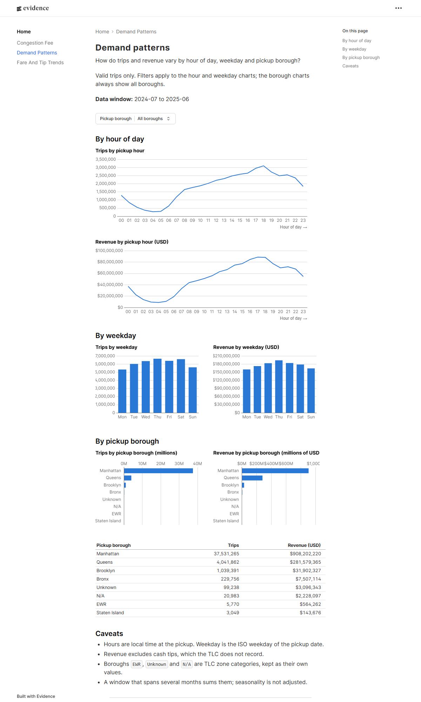
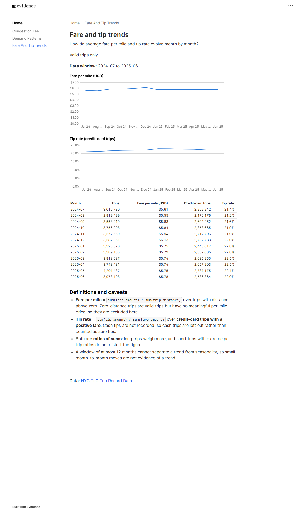
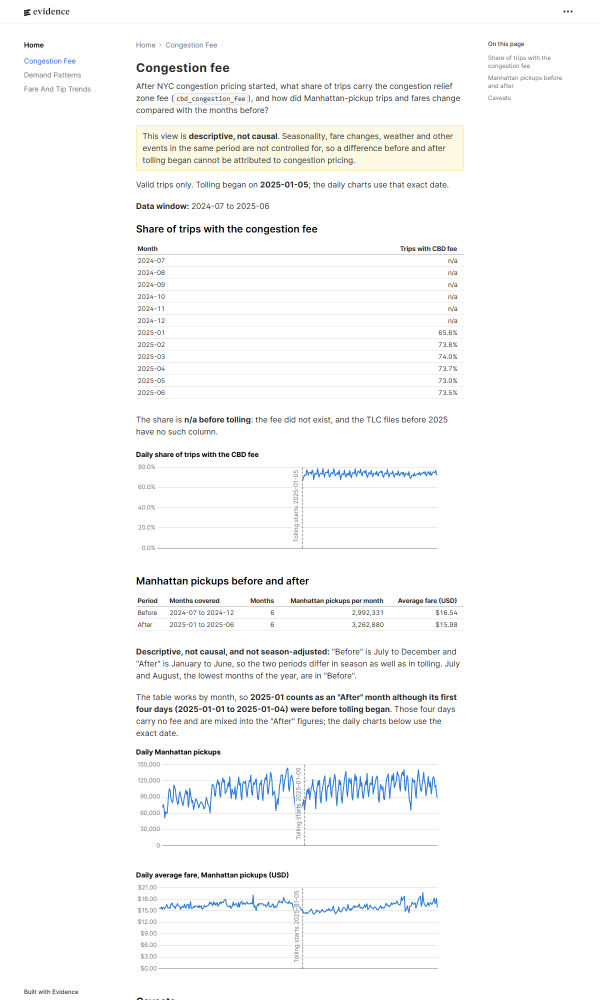
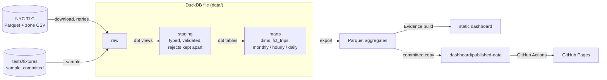

# nyc-taxi-metrics

[](https://github.com/kristhoffer14/nyc-taxi-metrics/actions/workflows/ci.yml)

A DuckDB + dbt pipeline over NYC TLC yellow taxi trips. It produces tested, documented
metrics and a static dashboard for a fictional stakeholder, the Head of Mobility Analytics.
It answers three questions:

1. How do trips and revenue vary by hour of day, weekday and pickup borough?
2. How do average fare per mile and tip rate evolve month by month?
3. After NYC congestion pricing started, what share of trips carry the congestion fee, and how
   did Manhattan-pickup trips and fares change compared with the months before?
   (Descriptive only; not causal.)

**Live dashboard:** <https://kristhoffer14.github.io/nyc-taxi-metrics/> (real data, 2024-07 to 2025-06;
published from the aggregated files described in [Published data](#published-data)).

| Demand patterns | Fare and tip trends | Congestion fee |
|---|---|---|
|  |  |  |

Screenshots come from the dashboard built on the full 12-month data.

## Architecture



Sample and real runs use separate databases and output folders, so a sample run can never
overwrite real data.

## Run it in 5 commands

Needs Python 3.12 and, for the dashboard, Node.js 22 (tested: CI runs 22 and local runs used 24;
older versions are not tested). Windows (PowerShell):

```powershell
py -3.12 -m venv .venv
.\.venv\Scripts\Activate.ps1
pip install -r requirements-dev.txt
python run_pipeline.py --sample
python build_dashboard.py --sample
```

On Linux or macOS, replace the second line with `source .venv/bin/activate` and the first
with `python3.12 -m venv .venv`. The sample run uses the committed fixture (two months,
about 6,000 rows) and needs no network. It writes the site to `dashboard/build/`.

Real data (downloads about 700 MB for the default window and takes a few minutes):
`python run_pipeline.py` for 2024-07 to 2025-06, or `--start YYYY-MM --end YYYY-MM`, then
`python build_dashboard.py`. Checks: `python -m pytest`, `ruff check .`, `ruff format --check .`,
`cd dbt; dbt build`.

## Findings

All figures are computed from the 12 months 2024-07 to 2025-06 (42,971,314 valid trips) by
[`scripts/compute_findings.py`](scripts/compute_findings.py), which reads the committed
aggregates. The one exception is the rejected-trip count (1,949,697 of 44,921,011 raw rows, 4.3%):
the aggregates do not hold it, so it is taken from the full-data run recorded in
[`docs/milestones/M2-acceptance.md`](docs/milestones/M2-acceptance.md) and the script does not
recompute it. Rejected trips are excluded from every figure; the rules are in
[`docs/metrics.md`](docs/metrics.md). Every finding is **descriptive, not causal**.

**1. Demand is concentrated in Manhattan and in the evening.** Manhattan has 87.3% of pickups
and Queens 9.4%. The busiest hour is 18:00 (7.2% of trips), then 17:00 and 19:00;
the quietest is 04:00 (0.6%). Thursday is the busiest weekday on average (about 128,000 trips
a day) and Monday the quietest (about 100,000).
*Limits:* weekday averages include holidays that fall on Mondays, and a window of 12 months
cannot separate the weekday pattern from the season.

**2. Fare per mile peaked in December and tips stayed near 22%.** Fare per mile ranges from
$5.55 (2024-08) to $6.13 (2024-12) and was $5.74 to $5.79 from February to June. The tip rate
is 21.2% (2024-08) to 22.8% (2025-01, 2025-02).
*Limits:* the tip rate covers credit-card trips only, because cash tips are not recorded; both
metrics are ratios of sums, so long and expensive trips weigh more; one year of data cannot
tell a trend from the season.

**3. About three in four trips carry the congestion fee once tolling is in force.**
The share was 65.6% in 2025-01 (which includes four days before tolling began on 2025-01-05)
and 73.0% to 74.0% from February to June. On the first tolled day it was 66.2%.
*Limits:* the data has no field for a trip's path, so the trips without the fee cannot be
classified further (for example, trips that never touched the zone).

**4. Manhattan pickups per month and average fare, before and after tolling began**
(descriptive, not causal; the periods differ in season):

| | Months | Manhattan pickups per month | Average fare |
|---|---|---|---|
| Before | 2024-07 to 2024-12 | 2,992,331 | $16.54 |
| After | 2025-01 to 2025-06 | 3,262,880 | $15.98 |

Trips per month are 9.0% higher after and the average fare 3.4% lower. **This is not an effect
of congestion pricing.** The "before" months are July to December and the "after" months are
January to June, so the two periods also differ in season. July and August, the two lowest months
(2.6 and 2.5 million Manhattan pickups), sit in the "before" period, which alone lowers its average.
The data has no year-earlier months to compare with, and weather, fare changes and other
events are not controlled for.

## Design decisions

The reasoning and the rejected alternatives are in [`docs/decisions.md`](docs/decisions.md). In short:

- **DuckDB, not Spark or a warehouse:** 45 million rows fit in one local file; no servers, accounts or credentials.
- **dbt for all transformations:** contracts on every mart, 49+ data tests and unit tests on the fare, tip and invalid-trip rules.
- **Reject, don't drop:** invalid trips go to a rejected model with a reason, and a test checks
  that raw rows = valid + rejected.
- **Ratios of sums** for fare per mile and tip rate, with the denominators documented.
- **`fct_trips` is incremental by month** and rebuilt when the staging rules change.
- **Evidence for the dashboard**, fed from Parquet exports of the marts, not from the trip table.
- **CI on every pull request** with pinned versions and no secrets; **GitHub Pages** is built only from aggregates.

## Published data

The live dashboard needs real data, but CI only has the small fixture. So the three dashboard marts
(`fct_monthly_metrics`, `fct_demand_hourly`, `fct_daily_congestion`; about 150 KB, aggregates only,
no trip rows) are committed in [`dashboard/published-data/`](dashboard/published-data/) with a
[`metadata.json`](dashboard/published-data/metadata.json). The committed copy currently covers
**2024-07 to 2025-06** and was **generated on 2026-10-09**.

Tests check that the files hold only the documented aggregate columns, that their schema matches the
dbt marts and that they reconcile with each other. They cannot tell whether the *values* are stale,
so check `metadata.json` before trusting the live site. To refresh after changing a model or
extending the window:

```powershell
python run_pipeline.py                      # load the real data and run dbt
python build_dashboard.py --publish-data    # rewrite dashboard/published-data/ and metadata.json
python scripts/compute_findings.py          # re-check the numbers quoted above
python build_dashboard.py                   # build the real-data site, for new screenshots
```

Then commit the changed files. Merging to `main` redeploys the site.

## How this project was built

It was built **spec-first with Claude Code**: [`docs/SPEC.md`](docs/SPEC.md) fixes the goals,
requirements and milestones, and the work was delivered in order, one milestone per branch and
pull request (M1 pipeline and models, M2 dashboard, M3 CI and docs). A milestone counts as met
only when its commands were run and the output recorded in
[`docs/milestones/`](docs/milestones/). Gaps in the spec are proposed in
[`docs/spec-change-requests.md`](docs/spec-change-requests.md) rather than edited in.

The M1 and M2 branches each got an **independent AI review in a fresh Claude session**.
These reviews found real bugs that were then fixed:
`fct_trips` silently disagreed with staging after a rule change; dropped downloads were not
retried; `python build_dashboard.py --sample` failed on a fresh clone; and an acceptance
criterion had been marked met too early. They are AI reviews, not human ones.

## Data source

Data: [NYC TLC Trip Record Data](https://www.nyc.gov/site/tlc/about/tlc-trip-record-data.page)
(yellow taxi trips and the taxi zone lookup). The TLC states that it did not create the trip data and
makes no representations about its accuracy. Raw files are downloaded on demand and never committed.

## Repository layout

| Path | Purpose |
|---|---|
| `pipeline/`, `run_pipeline.py` | download, load into DuckDB, run dbt |
| `dbt/` | staging views, marts, tests, unit tests, macros |
| `dashboard/`, `build_dashboard.py` | Evidence project, Parquet export, site build |
| `dashboard/published-data/` | committed aggregates behind the live site |
| `tests/` | pytest suite and the deterministic sample fixture |
| `docs/` | spec, metric definitions, decisions, milestone acceptance records |

Licensed under the terms in [`LICENSE`](LICENSE).
